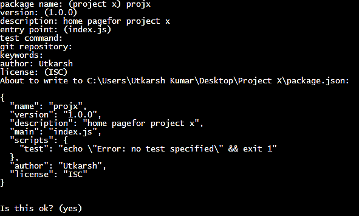
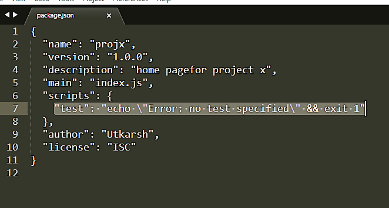
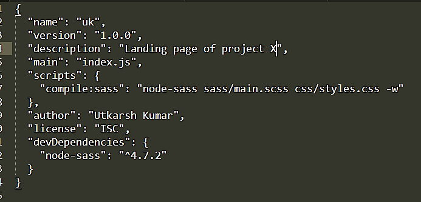

# Project-X

At first SASS may look bit confusing but it is very easy and handy.It makes the code highly reusable and maintainable.
# HOW TO INSTALL SASS COMPILER:
For this we will use node js and npm package where we get all the open source packages and one of these
package is a package to compile SASS. <addr>
 ###### **1. INSTALL NODE JS IN YOUR COMPUTER**
https://nodejs.org/en/ -link.
 ###### **2. CHECK IF NODE JS IS INSTALLED IN YOUR COMPUTER**
  Open cmd
   and write **node -v** if any version comes then  great you are ready to move forward.
  **Then navigate to the project folder **
  ###### **3.THEN CREATE package.json file**
  write following codes on terminal
  ###### npm init
 press enter then enter details as given in following picture.
 
 ###### **4.NOW INSTALL SASS COMPILER.**
 for that write following in cmd :
 ###### npm install node-sass --save-dev
 then hit enter.
 ###### **5.OPEN THE package.json FILE WHICH WILL BE AUTOMATICALLY CREATED AFTER THIS PROJECT AND THEN WE HAVE TO MODIFY THE SCRIPT THERE:
 
 ###### **"compile:sass": "node-sass sass/main.scss css/styles.css"** Syntax: "name": "node-sass inputfile outputfile"**
 Then save it.
  
 ###### 6.Then write **npm run compile:sass** in cmd an d it will compile your css files in  a single css file named styles.css in  css folder.
 #### Yeyy you are ready with your sass setup.
 
 ### Some extra notes:
 #### **For automatic compile on save make a litte modification in script in package.json and add -w in last as shown below as:**
**"compile:sass": "node-sass sass/main.scss css/styles.css -w"**
#### **For live server ** write the following command in cmd: 
##### npm install live-server -g 
then press enter
then open your project path and just write:
###### live-server
in your cmd.** -w will compile sass automatically and live server will run it without even without refreshing.So just edit your code in sass and it will be reflected in browser even without refreshing.
#### NOTE:
##### 1.Keep open the cmd for sass compiler and other cmd for live server if you close any then process will be terminated.
##### 2.If there is any error in sass code then error will be shown in cmd correct it then save so that the sass can be compiled sucessfuly.
##### 3.If any problem feel free to message me on whatsapp-8294115415

### -Utkarsh
